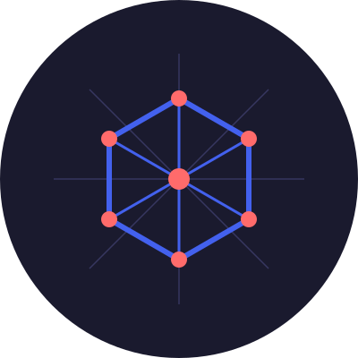

# NexSVG - AI-Powered Image to SVG Converter

<div align="center">
  

  [](https://opensource.org/licenses/MIT)
  [](https://nexsvg.art)
  [](https://x.com/nexsvg)
  [](https://github.com/NexSVG/imagetosvg)
</div>

## 🎯 Overview

NexSVG is a cutting-edge platform that leverages artificial intelligence to transform raster images into high-quality SVG vector graphics. Built with modern web technologies and powered by state-of-the-art machine learning models, NexSVG provides an intuitive interface for converting images while maintaining exceptional quality and accuracy.

### Key Features

- **Intelligent Conversion**: Advanced AI model for precise image-to-SVG transformation
- **Batch Processing**: Convert multiple images simultaneously
- **Real-time Preview**: Instant visualization of conversion results
- **Modern UI/UX**: Intuitive drag-and-drop interface
- **High Performance**: Fast processing with GPU acceleration
- **Format Support**: Wide range of input image formats supported

## 🏗️ System Architecture

```
┌─────────────────────────────────────────────────────────────────────┐
│                        Frontend Layer                               │
│                                                                     │
│   ┌─────────────────┐   ┌─────────────────┐   ┌─────────────────┐   │
│   │   Drag & Drop   │   │   SVG Preview   │   │   Download      │   │
│   │   Upload        │   │   Component     │   │   Manager       │   │
│   └─────────────────┘   └─────────────────┘   └─────────────────┘   │
└────────────────────────────────┬────────────────────────────────────┘
                                 │
                                 ▼
┌─────────────────────────────────────────────────────────────────────┐
│                           API Layer                                 │
│                                                                     │
│   ┌─────────────────┐   ┌─────────────────┐   ┌─────────────────┐   │
│   │  FastAPI        │   │  Image          │   │   Error         │   │
│   │  Endpoints      │   │  Processing     │   │   Handling      │   │
│   └─────────────────┘   └─────────────────┘   └─────────────────┘   │
└────────────────────────────────┬────────────────────────────────────┘
                                 │
                                 ▼
┌─────────────────────────────────────────────────────────────────────┐
│                       AI Processing Layer                           │
│                                                                     │
│   ┌─────────────────┐   ┌─────────────────┐   ┌─────────────────┐   │
│   │  StarVector     │   │   SVG           │   │   Quality       │   │
│   │  Model          │   │   Generation    │   │   Optimization  │   │
│   └─────────────────┘   └─────────────────┘   └─────────────────┘   │
└─────────────────────────────────────────────────────────────────────┘
```

## 💻 Technical Stack

### Frontend
- HTML5 with modern JavaScript (ES6+)
- TailwindCSS for styling
- Custom drag-and-drop implementation
- Real-time preview rendering

### Backend
- FastAPI for high-performance API endpoints
- Python 3.8+ for core processing
- StarVector AI model for image conversion
- CUDA support for GPU acceleration

### AI Model
- StarVector 1B model
- PyTorch for deep learning
- CUDA optimization for faster processing
- Custom image preprocessing pipeline

## 📂 Project Structure

```
nexsvg/
├── backend/              # FastAPI backend
│   ├── main.py          # Main FastAPI application
│   └── requirements.txt  # Python dependencies
├── frontend/            # Frontend application
│   ├── index.html      # Main HTML file
│   ├── styles/         # CSS styles
│   │   └── main.css    # Main stylesheet
│   └── js/            # JavaScript files
│       └── app.js     # Core application logic
├── .gitignore         # Git ignore rules
└── README.md          # Project documentation
```

## 🚀 Getting Started

### Prerequisites

- Python 3.8+
- CUDA-compatible GPU (recommended)
- Node.js 16+ (for development)

### Backend Setup

1. Install Python dependencies:
```bash
cd backend
pip install -r requirements.txt
```

2. Start the FastAPI server:
```bash
uvicorn main:app --reload --host 0.0.0.0 --port 8000
```

### Frontend Setup

1. Serve the static files:
```bash
cd frontend
python -m http.server 8080
```

2. Access the application:
- Open `http://localhost:8080` in your browser
- Upload images via drag & drop or file picker
- Click "Convert to SVG" to process
- Download the generated SVG files

## 📚 API Documentation

### POST /convert
Converts an uploaded image to SVG format.

**Request:**
- Method: POST
- Content-Type: multipart/form-data
- Body: file (image file)

**Response:**
- Content-Type: image/svg+xml
- Body: SVG content

### GET /health
Health check endpoint.

**Response:**
```json
{
    "status": "healthy",
    "version": "1.0.0"
}
```

## 🛣️ Roadmap

### Phase 1: Core Features
- ✅ Basic image to SVG conversion
- ✅ Drag and drop interface
- ✅ Real-time preview
- ✅ Download functionality

### Phase 2: Enhancement
- 🔄 Batch processing optimization
- 🔄 Advanced SVG optimization
- 🔄 Custom conversion parameters
- 🔄 API authentication

### Phase 3: Advanced Features
- 📅 User accounts and history
- 📅 Advanced editing tools
- 📅 API rate limiting
- 📅 Premium features

## 🤝 Contributing

We welcome contributions! Please read our contributing guidelines before submitting pull requests.

1. Fork the repository
2. Create a feature branch
3. Commit your changes
4. Push to the branch
5. Open a Pull Request

## 📄 License

This project is licensed under the MIT License - see the LICENSE file for details.

## 📞 Contact & Support

- Website: [nexsvg.art](https://nexsvg.art)
- Twitter: [@nexsvg](https://x.com/nexsvg)
- Email: support@nexsvg.art

Built with ❤️ by the NexSVG Team 